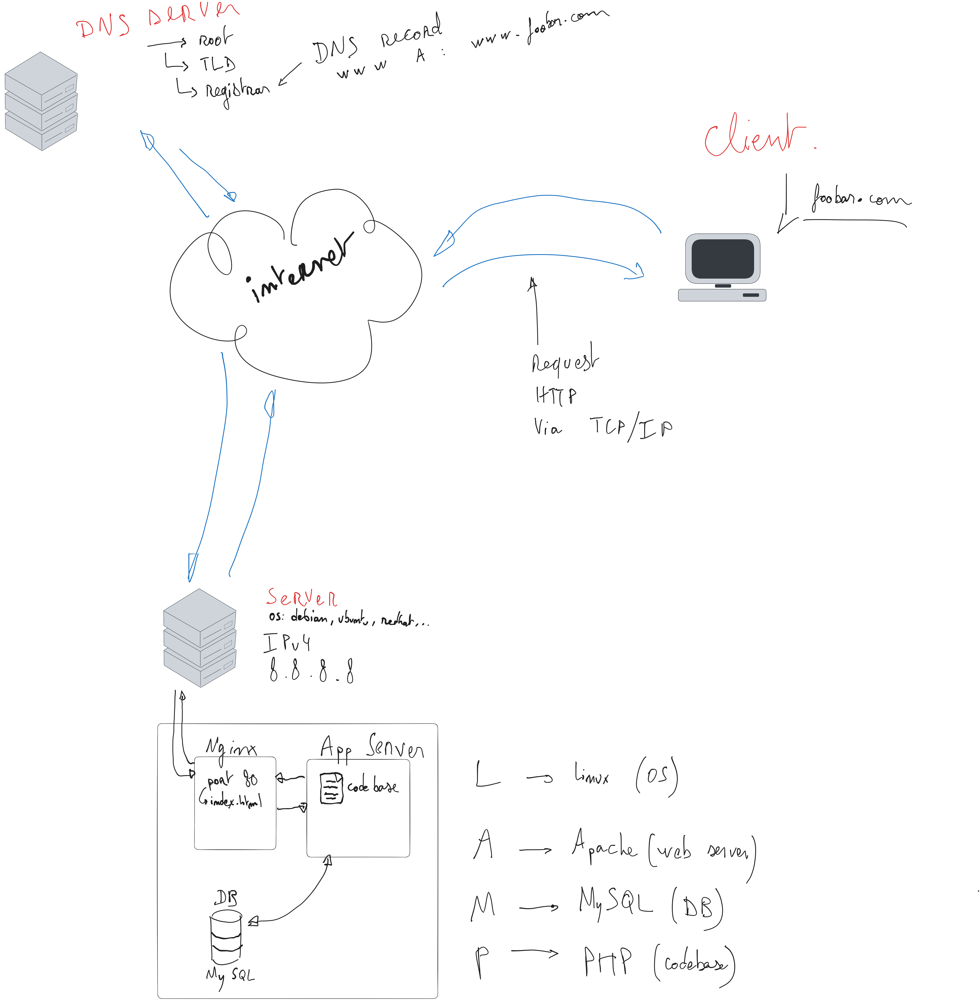

# 0. Simple Web Stack

## Diagram

## Description

Shows how a user accesses the website `www.foobar.com`, which is hosted on a single server.

- **Domain name**: foobar.com with a `www` **A record** pointing to **8.8.8.8**.
- **Single server**:
  - **Web server**: Nginx (example port 80 HTTP)
  - **Application server**: runs the codebase (example: PHP-FPM)
  - **Application files**: dynamic content generation (HTML, products list, etc.)
  - **Database**: MySQL

## Flow

1. User requests `www.foobar.com` in the browser.
2. DNS resolution occurs:
    - Root 
    - TLD .com
    - Registrar (example : OVH)
    - www A record (8.8.8.8)
3. Sends an **HTTP request via TCP/IP** to **8.8.8.8**
4. **Nginx** handles the request on port 80 HTTP
5. **Nginx** forwards to the **application server**, which queries the **MySQL database**
6. The server builds and sends the HTTP response back to the user

## Issues with this architecture

- **SPOF**: Single server, if it fails, the website goes down
- **Downtime during maintenance**: Deploying code or restarting services causes downtime
- **Scalability limits**: One server cannot handle high traffic

# 1. Distributed web infrastructure

## Diagram

## Description
This diagram shows a **distributed web infrastructure** for **www.foobar.com** using **HAProxy** as a load balancer for two servers.
This diagram **focuses on the distributed part** of the infrastructure, please refer to 0. Simple Web Stack for more information.

- **Domain name**: `www.foobar.com` with a `www` **A record** pointing to **the IP address of the load balancer**.
- **Load Balancer**:
  - **HAProxy** (software)
  - Configured with **Round Robin** algorithm to distribute incoming requests evenly between both servers.
- **Two Web Servers (A and B)**:
  - **Web server**: Nginx (example port 80 HTTP)
  - **Application server**: running the application codebase
  - **Database**: MySQL
    - **Server A**: **Primary (Master)** - handles writes and reads
    - **Server B**: **Replica (Slave)** - synchronizes data from Server A (read-only)

## Flow

1. User requests `www.foobar.com` in the browser... As shown before after DNS resolution :
2. DNS resolves to the **load balancer's IP address**.
3. HAProxy receives the request and forward it to **Server A** or **Server B**.
4. The selected server handles the request through:
   - **Nginx** (HTTP handling)
   - **App server** (business logic execution)
   - **MySQL database** (Primary or Replica depending on the request type)
5. The response is returned to the user

# 2. Secured and monitored web infrastructure

## Diagram

## Description
This diagram shows the **secured and monitored version** of the previous distributed infrastructure
This diagram **focuses on secured part** of the infrastructure, please refer to 1. Distributed web infrastructure for more information.

- **Domain name**: `www.foobar.com` with a `www` **A record** pointing to **the IP address of the load balancer**
- **Firewalls**:
  - **On Load Balancer**: Allows **only HTTPS traffic on port 443**.
  - **On Web Server A and B**: Allow **only traffic from the Load Balancer's internal IP**.
- **SSL Certificate**:
  - Installed on the **Load Balancer** to handle **HTTPS connections** (SSL termination).
- **Monitoring Agents** Sumologic:
  - Installed on the **Load Balancer**, **Server A**, and **Server B**.

## Flow

1. User requests `https://www.foobar.com` in the browser.
2. DNS resolves to the **load balancer's IP address**
3. **Firewall on Load Balancer** accepts traffic only on **port 443 (HTTPS)**
4. **Load Balancer** presents the **SSL certificate** to establish a **secure HTTPS connection** with the client
5. **Load Balancer (HAProxy)** uses **Round Robin** to forward **unencrypted HTTP traffic** to **Server A** or **Server B**
6. Each server handles the request via:
   - **Nginx** (HTTP handling)
   - **App server** (business logic execution)
   - **MySQL database** (Primary or Replica depending on the request type)
7. **Monitoring agents** collect server metrics and logs and send them to a **monitoring platform** (Sumologic)
8. The response is returned to the user

# 3. Fully Scaled and Split Infrastructure

## Diagram

## Description
This diagram shows a **scaled and split architecture** where the web server, application server, and database are **hosted on separate servers**. 
It also adds **redundancy at the load balancer level** with **two HAProxy instances** in **active-passive cluster mode**.
This diagram **focuses on scalability and component separation**, please refer to 2. Secured and monitored web infrastructure for more information.

- **Domain name**: `www.foobar.com` with a `www` **A record** pointing to **the IP address of the load balancers**
- **Load Balancer Cluster**:
  - **Two HAProxy instances** in **active-passive** mode
  - Configured with **Round Robin** algorithm to distribute traffic between multiple **Nginx servers**
  - **Firewall** allowing **only HTTPS traffic on port 443**
  - **SSL certificate** installed to handle **HTTPS termination**
  - **Monitoring Agent** 

- **Two Nginx Web Servers (Server A1 and A2)**:
  - **Firewall** allowing **only traffic from Load Balancer**
  - **Monitoring Agent**

- **Application Server (Server B)**:
  - Runs the **business logic**
  - **Firewall** allowing **only traffic from Nginx servers**
  - **Monitoring Agent**

- **Database Server (Server C)**:
  - Runs **MySQL**
  - **Firewall** allowing **only traffic from the Application Server**
  - **Monitoring Agent**

## Flow

1. User requests `https://www.foobar.com` in the browser
2. DNS resolves to the **load balancer cluster's IP address**
3. **Firewall on Load Balancer** accepts **only HTTPS traffic on port 443**
4. **Load Balancer** presents the **SSL certificate** to establish a **secure HTTPS connection**
5. **Load Balancer (HAProxy)** uses **Round Robin** to distribute **unencrypted HTTP traffic** to **Web Server A1** or **A2**
6. **Nginx** forwards the request to the **Application Server**
7. **Application Server** processes the request and queries the **Database Server** if needed
8. **Monitoring agents** on all servers **collect and send metrics/logs**
9. The response is returned to the user

